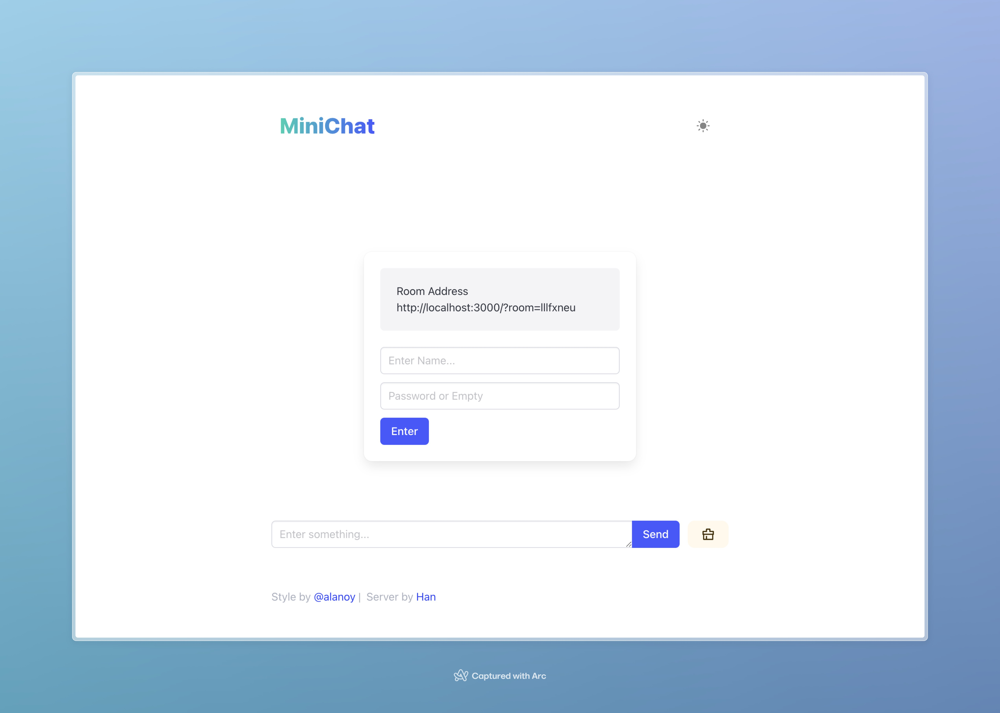
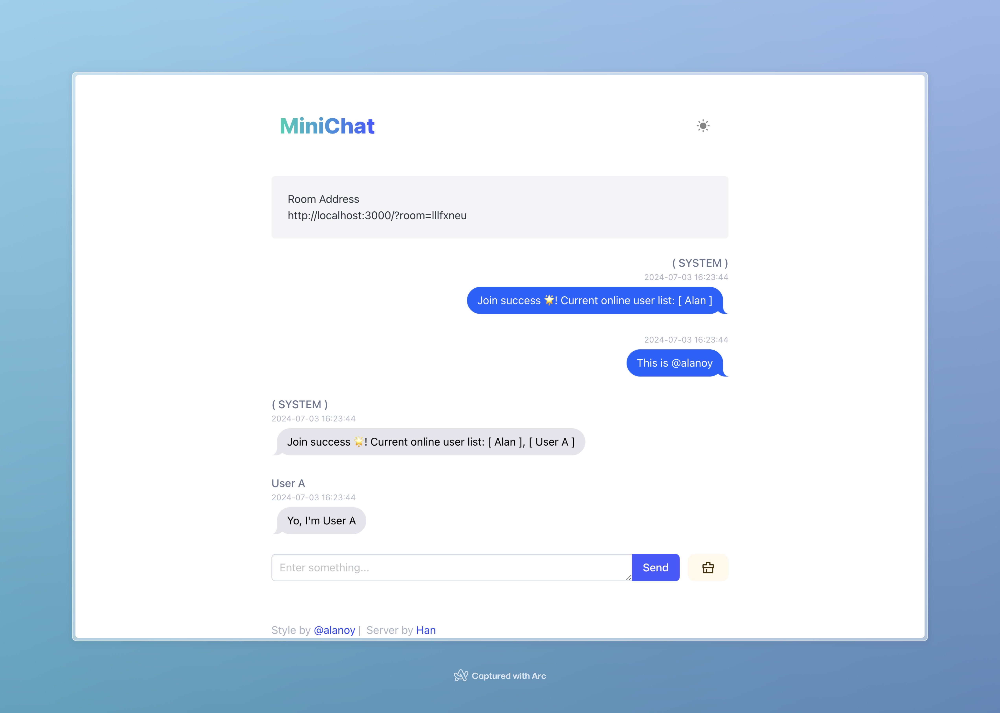
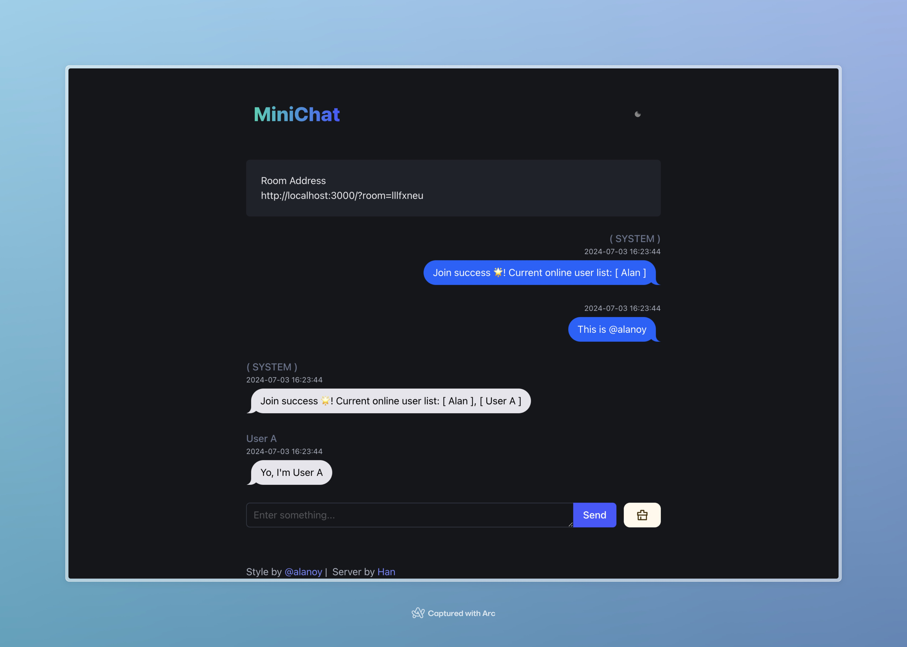

# MiniChat  

[click to demo](https://talks.im)  
  
MiniChat 是一款Go语言实现的极简、极轻、无痕匿名聊天工具，开发此程序的本意是用于自己平日与好友临时讨论敏感话题时使用，现开源共享，代码简陋，请多包涵。

**如有兴致，还请赏个 github 的 Star .**

## 特性

* 无数据库、无多余组件、打包后镜像仅 16M
* 支持自定义服务端口、支持单独配置后端服务 Server API
* 良好的匿名特性、安全隐私特性，数据只在服务器内存中毫秒级短暂中转不留痕
* 支持房间密码、后进房间不能观看之前记录等特性，非常安全
* 只需随意填写用户昵称，无任何真实信息，非常安全
* 所有人离开房间即销毁，非常安全
* 简洁但用心的界面布局
* 适配手机端、Web端

## 使用说明

> 🌟 其实只需要两步：
> 你输入地址进入，输入昵称，开始聊天
> 复制给别人地址，别人进入，输入昵称，开始聊天

1. 进入页面，若地址栏未携带 room=xxx 的参数，将随机产生一个新房间
2. 输入自己的昵称(随意)，点击进入房间即可
3. 将房间地址复制发送给其他小伙伴，小伙伴输入他自己的昵称(随意)后，将进入你的房间
4. 开始愉快且无痕且私密的聊天
5. 当所有房间内的人都离开后，房间会立刻销毁

## 部署方式

### 创建目录和配置文件

1. 创建 minichat 目录并 `cd` 到该目录下
```
mkdir minichat
cd minichat
```

2. 创建 config.yaml 配置文件
```
cat << EOF > ./minichat/config.yaml
port: 8080
server_url: ""
EOF
```

以下方式默认在 minichat 目录下操作

### Docker compose 方式（推荐）

1. 环境要求: Docker、Docker-Compose
2. 创建目录并下载 docker-compose.yaml:
```
wget https://raw.githubusercontent.com/okhanyu/minichat/master/docker-compose.yml
```
3. 修改 docker-compose.yml 文件，按需修改端口号（只需修改 docker-compose.yml 文件中 - "8080:8080" 中前面的8080即可，后面的 8080 代表容器内的端口要和 config.yaml 中的端口一致，后面默认 8080 即可无需修改）
4. 如有特殊需要，修改 config.yaml 文件，页面请求服务器的接口地址 server_url，如页面和服务使用同域名同端口，server_url 留空无需修改即可
5. 进入刚 clone 的 minichat 文件夹，执行
```
docker-compose up -d
```
6. 部署成功后，通过ip+端口号访问

### Docker run 方式

1. 环境要求: Docker
2. 如有特殊需要，修改 config.yaml 文件，修改页面请求服务器的接口地址 server_url，如页面和服务使用同域名同端口，server_url 留空无需修改即可
3. 执行（只需修改 -p 8080:8080 中前面的 8080 即可，后面的 8080 代表容器内的端口，要和 config.yaml 中的端口一致，后面默认 8080 即可无需修改）
```
docker pull okhanyu/minichat:latest
docker run -d --name minichattest --restart always \
  -p 8080:8080 \
  -v ./config.yaml:/app/config.yaml \
  -e TEMPLATE_NAME="bulma" \
  okhanyu/minichat:latest
```
4. 部署成功后，通过ip+端口号访问

### 二进制直接运行 方式（无需 Docker）

1. 环境要求: 无
2. minichat 文件夹内创建文件 config.yaml
3. 修改 config.yaml 文件，按需修改端口号和页面请求服务器的接口地址 server_url，如页面和服务使用同域名同端口，server_url 留空即可
```
port: 8080
server_url: ""
```
4. minichat 文件夹内，放置下载并解压好的[可执行文件](https://github.com/okhanyu/minichat/releases/)，保证 config.yaml 和 可执行文件在同目录下，双击打开可执行文件即可
5. 成功后，通过ip+端口号访问

### 环境变量

* `TEMPLATE_NAME` 页面模板，支持 `bulma | ddiu`，默认使用 `bulma`

## 其他
* 如果你需要的是一套支持自部署的完整、强大聊天室系统，请使用 [mattermost.com](https://mattermost.com/)
* 如果你需要的是一款支持自部署的复古、匿名聊天室系统，请使用 [hack.chat](https://hack.chat/)

## 模板作者

* ddiu by [ddiu8081](https://ddiu.io)
* bulma by [@alanoy](https://ideapart.com)
---





---

[](https://dartnode.com "Powered by DartNode - Free VPS for Open Source")
