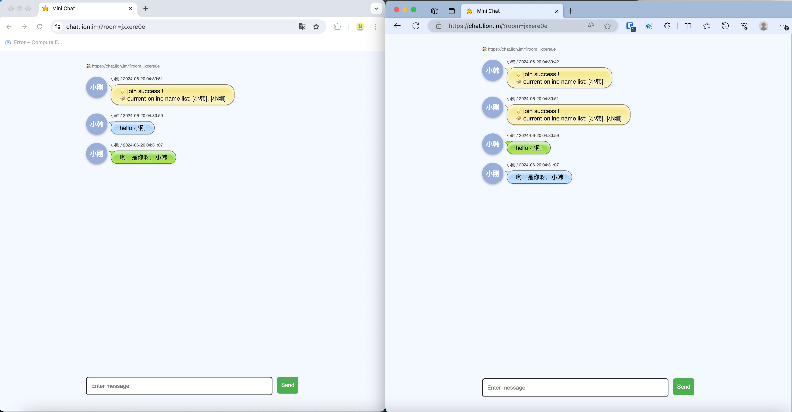
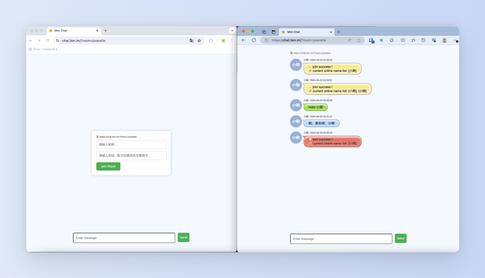

# Minichat
Minichat 是一款极简、极轻、无痕匿名聊天工具，开发此程序的本意是用于自己平日与好友临时讨论敏感话题时使用，现开源共享，代码简陋，请多包涵。

## 特性

* 无数据库、无前端组件、无日志，打包后镜像仅 16M
* 支持自定义服务端口、支持单独配置后端服务 Server API
* 良好的匿名特性、安全隐私特性数据只经内存中转不留痕
* 支持房间密码、后进房间不能观看之前记录等特性
* 所有人离开房间即销毁
* 简洁但用心的界面布局
* 适配手机端、Web端

## 使用说明
1. 进入页面，若地址栏未携带 room=xxx 的参数，将随机产生一个新房间
2. 输入自己的昵称(随意)，点击进入房间即可
3. 将房间地址复制发送给其他小伙伴，小伙伴输入他自己的昵称(随意)后，将进入你的房间
4. 开始愉快且无痕且私密的聊天
5. 当所有房间内的人都离开后，房间会立刻销毁


## 部署方式

### Docker compose 方式（推荐｜仅支持 linux-amd64 机器）

1. 环境要求: Git、Docker、Docker-Compose
2. 克隆项目:   
```
git clone https://github.com/okhanyu/minichat
```
3. 修改 config.yaml 文件，按需修改端口号和页面请求服务器的接口地址 server_url，如页面和服务使用同域名同端口，server_url 留空即可
4. 进入刚 clone 的 minichat 文件夹，执行
```
docker-compose up -d
```
5. 部署成功后，通过ip+端口号访问

### Docker run 方式

1. 环境要求: Git、Docker
2. 克隆项目:
```
git clone https://github.com/okhanyu/minichat
```
3. 修改 config.yaml 文件，按需修改端口号和页面请求服务器的接口地址 server_url，如页面和服务使用同域名同端口，server_url 留空即可
4. 进入刚 clone 的 minichat 文件夹，执行
```
docker pull okhanyu/minichat:latest  
docker run -d --name minichattest -p 8080:8080 -v $(pwd)/config.yaml:/app/config.yaml okhanyu/minichat:latest
```
5. 部署成功后，通过ip+端口号访问

### 可执行文件 方式

1. 环境要求: 无
2. 创建本地文件夹 minichat (名字随意)
3. minichat 文件夹内创建文件 config.yaml
4. 修改 config.yaml 文件，按需修改端口号和页面请求服务器的接口地址 server_url，如页面和服务使用同域名同端口，server_url 留空即可
```
port: 8080
server_url: ""
```
5. minichat文件夹内，放置下载好的可执行文件，保证 config.yaml 和 可执行文件在同目录下，双击打开可执行文件即可
5. 成功后，通过ip+端口号访问

   
  
